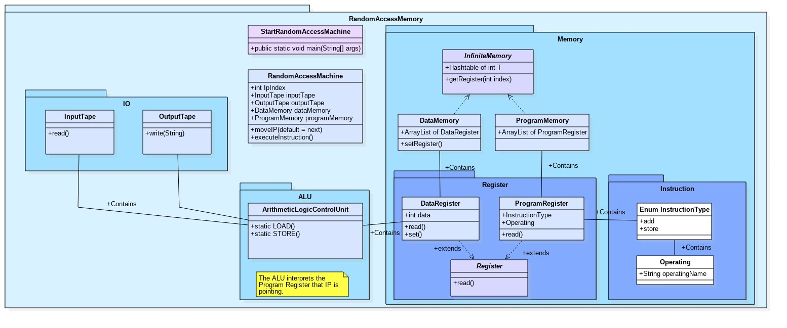

# Random Access Machine
Implementation of a Random Access Machine in Java programming language.
[Link to Documentation](https://ull-esit-inf-daa-1718.github.io/ull-esit-inf-daa-1718-pract1-angeligareta/)

## Status
Reached point 4 of Modification. Calculated logarithm from 0 to 1. Not finished for rest.

## Index
* [Description](#description)
* [UML Diagram](#uml-diagram)
* [Structure](#structure)
  * [ArithmeticLogicUnit](#ArithmeticLogicUnit)
  * [DataMemory](#DataMemory)
  * [DataRegister](#DataRegister)
  * [InfiniteMemory](#InfiniteMemory)
  * [InputTape](#InputTape)
  * [InstructionType](#InstructionType)
  * [Operating](#Operating)
  * [OutputTape](#OutputTape)
  * [ProgramMemory](#ProgramMemory)
  * [ProgramRegister](#ProgramRegister)
  * [RandomAccessMachine](#RandomAccessMachine)
  * [Register](#Register)
  * [StartRandomAccessMachine](#StartRandomAccessMachine)
* [Author](#author)

## Description
The aim of this project is to implement a Random Access Machine. The Random Access Machine is an abstract
computational-machine identical to the counter machine but adding the indirect addressing. The machine has a
Program Memory, Data Memory, Input Tape and OutputTape objects to execute a program. Besides it uses the
ArithmeticLogicUnit to do all the calculation.

## UML Diagram
Here there is an UML Class diagram representing how the project is structured:

## Structure
The classes are divided in:
### ArithmeticLogicUnit
Abstract class that represents the Arithmetic Logic Unit of the Random Access Machine. It has all the necessary
methods to assign, add, subtract, multiply and divide registers with another registers or with constants.

### DataMemory
Class that contains an array of the Data Register that the Random Access Machine will use.

### DataRegister
Data Register is a subclass of Register with the Integer data type. Besides it implements a method to change the data of the register.

### InfiniteMemory
InfiniteMemory is an abstract class that simulates an infinite TreeMap. The subclasses of InfiniteMemory must implement a getter and a setter of that TreeMap.

### InputTape
Class that does all the necessary operations with the inputTape. This includes creating the buffer, reading from it and closing it.

### InstructionType
InstructionType is an enum for all the instructions that our ram machine can have.

### Operating
Operating is an enum for all the operating that our ram machine can have.

### OutputTape
Class that does all the necessary operations with the outputTape. This includes creating the buffer, writing in it and closing it.

### ProgramMemory
The class ProgramMemory contains the Hash of lines-instruction that represents the program the machine is running.

### ProgramRegister
The class ProgramRegister contains the instruction in a register.

### RandomAccessMachine
The Random Access Machine is an abstract computational-machine identical to the counter machine but adding the indirect addressing. The machine has a Program Memory, Data Memory, Input Tape and OutputTape objects to execute a program. Besides it uses the ArithmeticLogicUnit to do all the calculation.

### Register
Abstract class that represents a generic type of register and contains a data and a method to read it.

### StartRandomAccessMachine
Class that starts a Random AccessMachine depending on the arguments passed to main method.

## Author
   * [Ángel Igareta](https://github.com/angeligareta)
